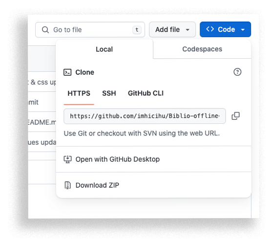

## JUSTIFICACIÓN

* Herramienta interna de diagnóstico y prueba y a partir de ahora... ¡para todo el mundo! Entonces, nada de imágenes internas o entrelazadas, archivos javascript al mínimo, nada de `Códigos de conducta`, menos códigos de rastreo... ¡todo esto resulta y sólo implica un buscador minimalista de registros bibliográficos -precisamente de nuestra biblioteca- y abierto para todos!
* Los objetivos propuestos y alcanzados han sido el minimalismo en su diseño; la cooperación, ensamblado y sinergia entre distintas tecnologías para encajar con otras [herramientas](https://biblio-searcher.surge.sh/) que pronto se presentarán; pasando por la velocidad de respuesta en la solicitud de datos
* Este repositorio es un documento vivo que _crecerá_ y se adaptará a través del tiempo

### Modalidades de instalación
* Método sencillo:
	* [Descargar](https://codeload.github.com/imhicihu/Biblio-offline-searcher/zip/refs/heads/main) este repositorio
	* Descomprimir `Biblio-offline-searcher-main.zip`.
	* Doble clic en `index.html`
	* Voilà!
* Método _Techie_:
	* En tu terminal, [clonar](https://github.com/imhicihu/Biblio-offline-searcher.git) este repositorio
	  
	
	* Doble clic en `index.html`
	* Voilà!
### Comprobaciones
* Probado y validado en estos navegadores web:

| Navegador (Mac & PC) | Prueba superada
|:--|:--|
| Internet Explorer | ✓ |
| Microsoft Edge | ✓ |
| Firefox Developer Edition | ✓ |
| Apple Safari| ✓ |
| Apple Safari Technology Preview| ✓ |
| Google Chrome| ✓ |
   
### Descargo
* Este repositorio es sólo para fines académicos. Está destinado al uso educativo y de investigación, y no debe utilizarse con fines comerciales.
      
### Licencia
* El contenido de este proyecto está licenciado bajo la [Licencia MIT](LICENSE)
