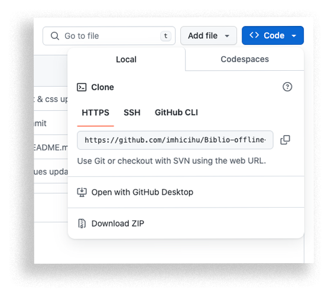

## RATIONALE ([JUSTIFICACIÓN](LEEME.MD))

* Internal tool for diagnostic and test and now to the masses! So, no internal or interlinked images, minimal javascript, no code of conduct, no tracking codes... all of this results and just only involves a database searcher of our library and open to everyone!
* The goals proposed and achieved have been minimalism in its design, consistency with other tools soon to be [realised](https://biblio-searcher.surge.sh/), and speed of response on data request
* This repo is a living document that _will_ grow and adapt over time

### Installation procedures
* Simple method:
	* [Download](https://codeload.github.com/imhicihu/Biblio-offline-searcher/zip/refs/heads/main) this repository
	* Unzip `Biblio-offline-searcher-main.zip`
	* Double-click on `index.html`
	* Voilà!
* _Techie_ method:
	* In your terminal, [clone](https://github.com/imhicihu/Biblio-offline-searcher.git) this repository
	
	* Double-click on `index.html`
	* Voilà!
### Tests
* Tested & validated in these web browsers:

| Browser (Mac & PC) | Test passed |
|:--|:--|
| Internet Explorer | ✓ |
| Microsoft Edge | ✓ |
| Firefox Developer edition| ✓ |
| Apple Safari | ✓ |
| Apple Safari Technology Preview| ✓ |
| Google Chrome | ✓ |

### Disclaimer
* This repository is for academic purposes only. It is intended for educational and research use, and should not be used for any commercial purposes.
      
### License
* The content of this project itself is licensed under the [MIT Licence](LICENSE)
